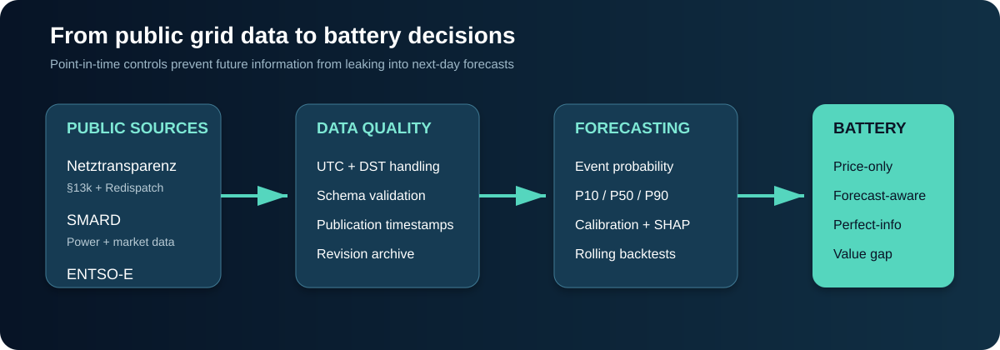
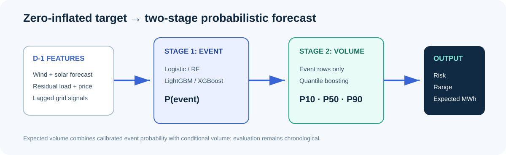
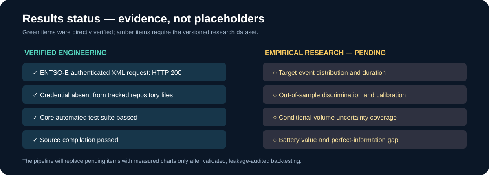

# German Battery Grid Congestion & Curtailment Engine

[](https://github.com/MhdAsker/german-battery-grid-congestion-engine/actions/workflows/ci.yml)


A Master's-level applied energy-data-science project investigating whether next-day German renewable
curtailment and grid-congestion risk can be predicted from public system data—and whether calibrated
forecasts can improve the charging decisions of a hypothetical battery energy storage system (BESS).

The project connects four normally separate tasks: point-in-time energy data engineering,
probabilistic machine learning, explainable forecasting, and counterfactual battery optimization.



> **Research status:** the complete research scaffold is implemented. Empirical model scores and
> economic results are deliberately marked **pending** until a versioned public-data snapshot passes
> validation and the chronological backtest is run. This repository does not invent observations,
> API fields, or portfolio results.

## Project achievements

- Designed a leakage-aware data model that records when each input became available—not merely the
  delivery interval it describes.
- Integrated explicit adapters for Netztransparenz, SMARD and the authenticated ENTSO-E Transparency
  API, with raw-response preservation and schema-change failures.
- Built UTC-first time-series validation covering DST transitions, duplicate timestamps, missing
  intervals, nonnegative quantities and source-unit checks.
- Implemented a two-stage hurdle forecast: calibrated curtailment-event probability followed by
  event-conditional P10/P50/P90 volume estimates.
- Added operational and statistical baselines so model value is measured against realistic reference
  strategies rather than accuracy alone.
- Connected forecast quality to battery decisions through price-only, forecast-aware and
  perfect-information dispatch scenarios.
- Added false-positive/false-negative value curves, forecast imperfection loss, feature/target drift,
  seasonal monitoring, SHAP explainability and T-24h/T+24h event studies.
- Delivered a six-page Streamlit interface, CLI, automated tests, GitHub Actions and Docker packaging.

## Why German grid congestion matters

Redispatch changes power injections to prevent or resolve network congestion while maintaining the
system balance. Renewable down-regulation is related to—but not synonymous with—negative wholesale
prices. Prices are bidding-zone signals; physical congestion is spatial and depends on the network.
As variable renewable generation grows, a well-calibrated congestion-risk forecast could help
flexible demand or batteries preserve charging headroom before high-risk intervals.

The primary outcome is observed renewable curtailment wherever a defensible public target can be
constructed. The Section 13k *Nutzen statt Abregeln* publication is treated separately as a genuine
next-day forecast/allocation signal. It is never relabelled as realized curtailment.

## Research questions

1. How predictable are German curtailment events one day ahead?
2. Which observable system variables are most predictive of those events?
3. Are positive curtailment volumes predictable, including uncertainty bounds?
4. Are event probabilities calibrated and stable across seasons?
5. Do negative prices add information beyond renewables and residual load?
6. Can forecast-aware battery scheduling behave meaningfully differently from price-only dispatch?
7. What is the operational cost of false negatives and imperfect forecasts?
8. Where do public-data limitations prevent asset-specific conclusions?

## Data and point-in-time design

| Source | Variables | Role in the study |
|---|---|---|
| Netztransparenz | Redispatch, Section 13k next-day quantities, relief regions, storage generation-ban status | Congestion/curtailment target candidates and forward-looking grid signals |
| SMARD | German load, generation, wind, solar, prices and exchanges | National power-system and market features |
| ENTSO-E | Actual/forecast load and generation, DA prices and cross-border flows | Forecast and market fundamentals with revision-aware raw XML |

Canonical observations use a timezone-aware UTC index. Europe/Berlin is derived only for market-day
and calendar interpretation. Each forecast feature should carry an `available_at_utc` timestamp and
is masked whenever it was published after the configured D-1 issuance time. Realized inputs enter
only with conservative lags. Missing data remain missing; they are never silently converted to zero.

See [DATA_SOURCES.md](docs/DATA_SOURCES.md), [DATA_DICTIONARY.md](docs/DATA_DICTIONARY.md), and
[ASSUMPTIONS.md](docs/ASSUMPTIONS.md) for source URLs, units, native resolutions, publication timing,
forecast/actual status and known-at-issuance decisions.

## Methods

### 1. Target definition and exploratory analysis

Modeling begins only after measuring zero share, skew, seasonality, autocorrelation, regional
differences, event frequency and event duration. A configurable meaningful-volume threshold defines:

```text
y_event = 1 when curtailment_mwh > threshold, otherwise 0
y_volume_event = curtailment_mwh conditional on y_event = 1
```

Strong measured zero inflation motivates the hurdle design. The event threshold is varied in
sensitivity analysis rather than presented as a physical constant.

### 2. Feature engineering

- **Power system:** load/wind/solar forecasts, renewable forecast and forecast residual load.
- **Market:** day-ahead price when published before issuance, negative-price flag and lagged profile.
- **Network proxies:** lagged redispatch/curtailment and cross-border position where timely.
- **Dynamics:** load, wind and solar ramps and forecast changes.
- **Calendar:** cyclical hour, weekday, month and season.
- **Regional:** publisher-defined relief-region identifiers when supported by source data.

Feature availability is audited row by row. Contemporaneous actual generation, load, redispatch or
curtailment is prohibited because it would not exist at next-day forecast issuance.

### 3. Models

| Task | Baselines | Candidate models | Output |
|---|---|---|---|
| Event classification | Always no event, previous-day event | Logistic regression, random forest, LightGBM, XGBoost | Curtailment probability |
| Conditional volume | Persistence, expanding seasonal mean | Histogram gradient boosting, LightGBM, XGBoost | Positive-event volume |
| Probabilistic volume | Historical quantiles | Quantile boosting at 0.10, 0.50 and 0.90 | P10/P50/P90 |
| Explainability | Coefficients/feature ablation | SHAP global and event-level explanations | Predictive associations |

The implemented `HurdleForecaster` returns event probability, conditional-volume quantiles and
probability-weighted expected volume. Optional LightGBM, XGBoost and SHAP dependencies are installed
with the `ml` extra.



### 4. Backtesting and metrics

All evaluation is chronological. Expanding-window splits train only on observations preceding each
test window; random train/test splits are forbidden. Preprocessing and imputation must be fit inside
each fold.

Classification reporting emphasizes:

- precision, recall and F1;
- PR-AUC as the primary discrimination metric for rare events;
- ROC-AUC for comparison;
- Brier score and calibration curves for probabilistic quality;
- season-specific and rolling performance.

Conditional-volume reporting uses MAE, RMSE and quantile pinball loss. Probabilistic forecasts are
also evaluated by empirical P10–P90 interval coverage.

### 5. Explainability and event studies

SHAP summaries answer whether variables such as wind forecast, residual load, price and cross-border
position are predictive of modeled risk. Local explanations accompany individual forecast events.
The language is intentionally associational: a feature can be predictive without causing congestion.

Major-event windows show T-24h through T+24h wind, solar, load, residual load, day-ahead price,
flows, redispatch and curtailment to connect model behavior to system conditions.

## Battery opportunity model

The convex optimization represents a configurable BESS with power, energy, state-of-charge bounds,
charge/discharge efficiency and throughput degradation cost. It compares:

- **A — Price-only:** optimizes wholesale energy-market value.
- **B — Forecast-aware:** adds probability-weighted value for charging during predicted opportunity.
- **C — Perfect information:** uses realized opportunity as an upper benchmark.

For interval \(t\), the scenario objective is conceptually:

```text
market discharge value
- market charging cost
+ configured value of absorbed opportunity
- battery degradation cost
```

SOC balance, power limits, energy limits, efficiency losses and available opportunity constrain the
schedule. The model reports incremental forecast value, perfect-information value and the value lost
because forecasts are imperfect. Probability-threshold sweeps expose the trade-off between false
charging actions and missed congestion events.

**This is a counterfactual system-level flexibility study. Public aggregated data do not establish
asset-specific electrical connectivity, technical or contractual eligibility, deliverability, or
guaranteed access to or monetization of curtailed MWh.**

## Results



### Current verified engineering results

| Deliverable | Status |
|---|---|
| ENTSO-E DE-LU authenticated request | Verified: HTTP 200 XML response |
| Secret isolation | Verified: token absent from tracked files |
| Core automated tests | 7 passed; CVXPY dispatch test skipped when solver dependency is absent |
| Python source compilation | Passed |
| GitHub Actions CI | Configured |
| Empirical target statistics | Pending validated data snapshot |
| Model performance and calibration | Pending chronological backtest |
| SHAP/event-study findings | Pending trained models |
| Battery forecast-value estimates | Pending out-of-sample forecasts |

### Empirical results contract

No forecast score or economic value is claimed yet. After the validated dataset is built, this section
will report the following with data checksum, retrieval time, date splits and configuration:

| Research output | Required result |
|---|---|
| Target profile | Zero/event share, skew, autocorrelation, seasonal/regional distribution, run duration |
| Event models | Baseline and candidate precision, recall, F1, PR-AUC, ROC-AUC and Brier score |
| Calibration | Reliability curve and probability-bin counts |
| Volume models | Baseline/model MAE and RMSE; P10/P50/P90 pinball loss and coverage |
| Incremental features | With/without-price and with/without-flow ablations |
| Stability | Seasonal performance, rolling scores, target drift and feature drift |
| Battery value | Price-only, forecast-aware and perfect-information objectives |
| Error economics | Threshold curve plus false-positive and false-negative sensitivity |

This separation between implemented engineering results and pending empirical findings prevents
unvalidated portfolio claims.

### Reproducible result graphs

The repository includes a strict chart renderer for the empirical results. It reads measured CSV
artifacts and generates four publication-ready SVG figures:

- held-out PR-AUC and Brier-score model comparison;
- probability reliability/calibration curve;
- P10/P50/P90 conditional-volume pinball loss;
- price-only versus forecast-aware versus perfect-information battery value.

```powershell
python scripts/render_results.py
```

The command intentionally fails if any artifact is absent, empty, lacks held-out test rows or has the
wrong schema. Expected files and columns are documented in [reports/RESULTS.md](reports/RESULTS.md).
This makes every displayed performance graph traceable to a real backtest rather than an illustrative
number. After a successful research run, the generated figures are committed alongside the dataset
checksum, retrieval timestamp, split dates and configuration.

## Dashboard

The Streamlit application includes:

1. Germany System Overview
2. Curtailment Monitor
3. 24h Forecast
4. Model Explainability
5. Historical Event Explorer
6. Storage Opportunity Simulator

If validated data or model artifacts are absent, the dashboard displays a clear status message rather
than generating synthetic observations.

## Repository structure

```text
src/gridflex/
  ingestion/        # ENTSO-E, SMARD and Netztransparenz adapters
  validation/       # time index, missingness, unit and quality checks
  features/         # target construction and leakage-aware feature creation
  forecasting/      # baselines, hurdle model and metrics
  explainability/   # SHAP integration
  battery/          # convex BESS dispatch
  economics/        # threshold and perfect-information value
  backtesting/      # expanding chronological splits
dashboard/          # Streamlit application
configs/            # target, split and battery assumptions
docs/               # sources, dictionary, assumptions, methodology, limitations
tests/               # automated unit tests
```

## Reproduction

```powershell
python -m venv .venv
.\.venv\Scripts\Activate.ps1
pip install -e ".[dev,ml]"
Copy-Item .env.example .env
# Add ENTSOE_API_KEY to the local .env; never commit it.
pytest
streamlit run dashboard/app.py
```

Validate and inspect a canonical dataset before training:

```powershell
gridflex validate data/processed/unified.parquet --frequency 15min
gridflex diagnose-target data/processed/unified.parquet --threshold 0.1
```

Detailed scientific design and caveats are documented in [METHODOLOGY.md](docs/METHODOLOGY.md) and
[LIMITATIONS.md](docs/LIMITATIONS.md).

## Responsible interpretation

This repository is a research and portfolio project, not investment advice, a trading system or a
claim that a specific battery can capture curtailed energy. Its central contribution is the auditable
connection between point-in-time public data, probabilistic congestion forecasts and transparent
counterfactual flexibility decisions.
